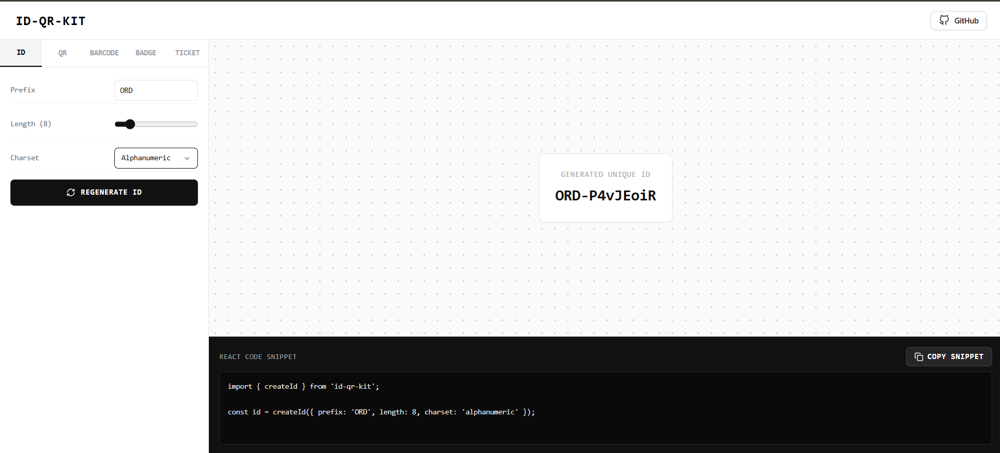
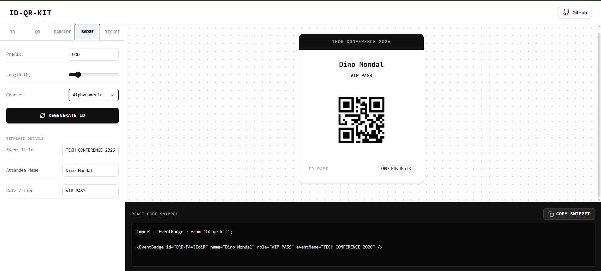
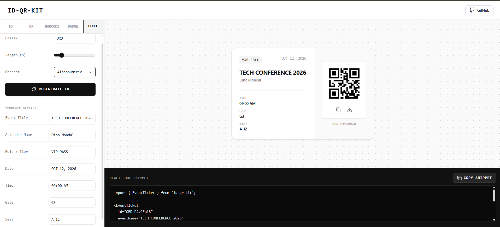
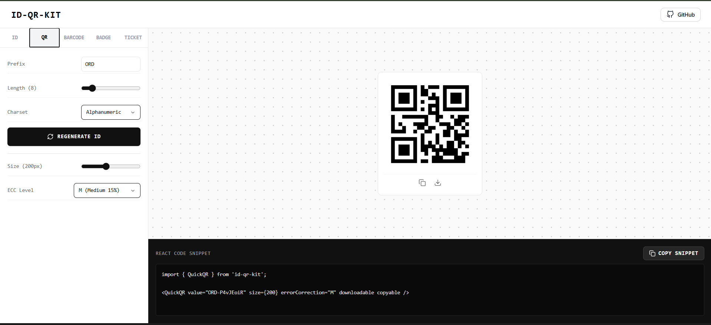
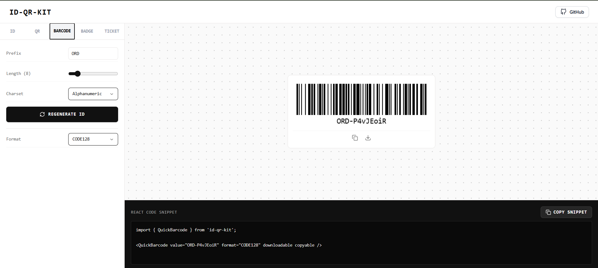
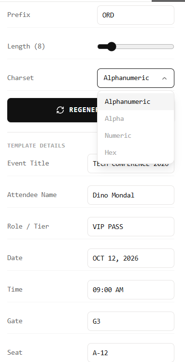

# ID-QR-Kit

**Modern, modular, and developer-friendly React component library for generating Identity Cards, Event Badges, Tickets, QR Codes, and Barcodes.**

ID-QR-Kit provides composable UI templates, native QR/barcode rendering, high-resolution export utilities, and an optional Python automation pipeline for batch generation workflows.

---

## Features

* **Modular composition** — Pre-built templates for ID cards, event badges, and tickets.
* **Native scannable assets** — QR code and barcode generation using matrix encoders.
* **High-fidelity exporting** — Export DOM nodes as **PNG**, **SVG**, or **PDF**.
* **Type-safe API** — Built entirely with **TypeScript**.
* **Utility-first styling** — Powered by **Tailwind CSS**.
* **Backend automation** — Includes a standalone Python script for headless batch generation.

---

## Tech Stack

| Layer      | Technologies          |
| ---------- | --------------------- |
| Frontend   | React, Vite           |
| Styling    | Tailwind CSS, PostCSS |
| Language   | TypeScript            |
| Rendering  | HTML5 Canvas API, SVG |
| Encoding   | Matrix encoders       |
| Automation | Python                |

---

## Live Demo & Repository

* **Live Playground:** https://s0um1kx.github.io/id-qr-kit/
* **GitHub Repository:** https://github.com/s0um1kx/id-qr-kit

---

## Screenshots

### Templates

| ID Card                                         | Event Badge                                            | Ticket                                             |
| ----------------------------------------------- | ------------------------------------------------------ | -------------------------------------------------- |
|  |  |  |

### Generators & Controls

| QR Generator                                         | Barcode Generator                                              | Controls Interface                                     |
| ---------------------------------------------------- | -------------------------------------------------------------- | ------------------------------------------------------ |
|  |  |  |

---

## Local Development

```bash
# Clone the repository
git clone https://github.com/s0um1kx/id-qr-kit.git
cd id-qr-kit

# Install dependencies
npm install

# Start development server
npm run dev
```

The playground supports live editing of badge data, QR/barcode values, and export testing.

---

## Installation

### Option A — Copy Source Directories

Copy these folders into your project:

```text
src/components
src/core
src/hooks
src/templates
```

Install peer dependencies:

```bash
npm install tailwindcss postcss autoprefixer
```

---

### Option B — Import from Library Entry

```tsx
import { IDCard, QRCode, Barcode } from './src';

export function UserProfileBadge() {
  return (
    <div className="flex flex-col items-center p-4">
      <IDCard
        avatarUrl="/avatar.png"
        department="Engineering"
        name="Alex Mercer"
        title="Systems Architect"
      >
        <QRCode
          size={128}
          value="https://github.com/s0um1kx/id-qr-kit"
        />

        <Barcode
          format="CODE128"
          value="ID-98402-X"
        />
      </IDCard>
    </div>
  );
}
```

---

## Project Structure

```text
id-qr-kit/
├── playground/
│   ├── App.tsx
│   ├── index.css
│   └── main.tsx
├── public/
│   ├── screenshots/
│   │   ├── preview-id.png
│   │   ├── preview-badge.png
│   │   ├── preview-ticket.png
│   │   ├── preview-qr.png
│   │   ├── preview-barcode.png
│   │   └── preview-controls.png
│   └── favicon.ico
├── python/
│   └── id_kit.py
├── src/
│   ├── components/
│   ├── core/
│   ├── hooks/
│   ├── templates/
│   ├── index.ts
│   └── vite-env.d.ts
├── package.json
├── tailwind.config.js
├── tsconfig.json
└── vite.config.ts
```

---

## Architecture

```text
┌──────────────────────────────────────────────┐
│                 Playground                   │
│          App.tsx / Interactive UI            │
└──────────────────────┬───────────────────────┘
                       │
                       ▼
┌──────────────────────────────────────────────┐
│               src/templates                  │
│      ID Cards / Badges / Ticket Layouts      │
└───────────────┬───────────────────┬──────────┘
                │                   │
                ▼                   ▼
┌──────────────────────┐   ┌──────────────────────┐
│    src/components    │   │      src/hooks       │
│ QRCode / Barcode UI  │   │ Export & Canvas API │
└────────────┬─────────┘   └────────────┬─────────┘
             │                          │
             └────────────┬─────────────┘
                          ▼
           ┌────────────────────────────┐
           │          src/core          │
           │ Encoders / Matrix Logic    │
           └────────────────────────────┘
```

### Rendering Flow

1. **Core layer** converts input strings into QR/barcode matrices.
2. **Component layer** renders SVG or Canvas output.
3. **Template layer** composes visual layouts.
4. **Hook layer** exports rendered components to image or document formats.

---

## Export Support

Supported output formats:

* PNG
* SVG
* PDF

Example:

```tsx
const { exportPNG } = useExportCard(ref);

<button onClick={exportPNG}>Download PNG</button>
```

---

## Python Automation

Generate assets without a browser:

```bash
cd python
python id_kit.py
```

Typical use cases:

* Batch employee ID generation
* Event pass printing
* Offline asset rendering pipelines

---

## Development Scripts

```bash
npm run dev       # Start Vite dev server
npm run build     # Production build
npm run preview   # Preview production build
npm run lint      # Run linter
```

---

## Customization

Override Tailwind classes directly on templates or components:

```tsx
<IDCard className="bg-slate-900 text-white border-slate-700" />
```

You may also extend `tailwind.config.js` with custom themes, spacing, or typography tokens.

---

## Roadmap

* [ ] NPM package publishing
* [ ] React Native support
* [ ] Print-optimized templates
* [ ] Bulk export worker queue
* [ ] Dark-mode preset themes
* [ ] Accessibility audit

---

## Contributing

```bash
git checkout -b feature/my-feature
npm test
npm run build
```

Open a pull request with a clear description and screenshots for UI changes.

---

## License

MIT License.

---

## Author

**Soumik**

* GitHub: https://github.com/s0um1kx
* Project: https://github.com/s0um1kx/id-qr-kit
